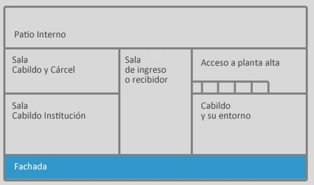
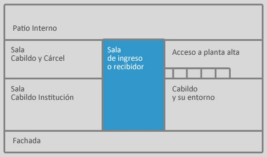
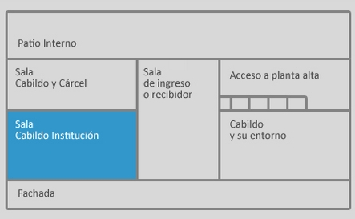
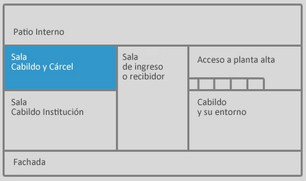
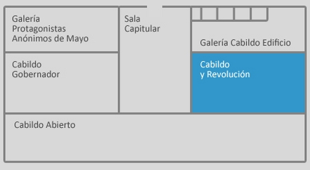
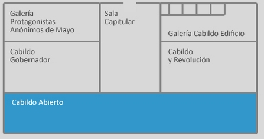
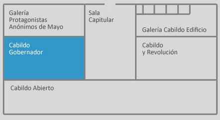

<h2>Índice de contenidos</h2>

<ul>
<li><a href="#orgheadline8">1. Planificaciones de Ciencias Sociales</a>
<ul>
<li><a href="#orgheadline4">1.1. Secuencia Ciudadanía</a>
<ul>
<li><a href="#orgheadline3">1.1.1. clase Nº 1</a></li>
</ul>
</li>
<li><a href="#orgheadline7">1.2. Secuencia De la Revolución de Mayo a la Independencia</a>
<ul>
<li><a href="#orgheadline5">1.2.1. Secuencia: Recorrido virtual por el Museo Histórico del Cabildo.</a></li>
<li><a href="#orgheadline6">1.2.2. Secuencia: Mariano Moreno, vida obra y legado.</a></li>
</ul>
</li>
</ul>
</li>
</ul>

# Planificaciones de Ciencias Sociales

## Secuencia Ciudadanía

### clase Nº 1

**Propósitos:** 

-   Propiciar espacios en los que los alumnos puedan tomar la palabra y expresarse.
-   Conocer y valorar las formas de participación política y ciudadana.  Analizar el funcionamiento del sistema electoral considerando su importancia como herramienta del sistema democrático y la influencia que ejerce en el proceso de elección de gobernantes.

**Duración de la clase**: 1 hora reloj

**Contenidos**:

-   La participación política y ciudadana
    -   Qué es un sistema electoral. El voto. Características. Ley Sáenz Peña.
    -   La ampliación de derechos cívicos: el voto femenino y la incorporación a las urnas de los/as jóvenes desde los 16 años.

**Organización de la clase**

**Momento 1**: 

Comenzaremos indagando los saberes previos de los/as estudiantes sobre el tema con preguntas disparadoras ¿Saben que este año se celebran elecciones? ¿Qué cargos se elegirán? ¿Cuándo se realizarán? ¿Quiénes pueden votar? 
Se registrarán las respuestas en el pizarrón.

**Momento 2**:
A continuación se conversará con los/as estudiantes acerca de la forma de gobierno de nuestro país: Representativa, republicana y federal haciendo hincapié en la primera característica.

La **forma representativa** significa que si bien el gobierno es ejercido por el pueblo, éste no lo hace en forma directa sino a través de sus representantes, quienes son elegidos a través del voto. Son ellos quienes representan al pueblo en forma plural.
Para reafirmar esto, el artículo 22 de la Constitución de la Nación Argentina declara que 

> “el pueblo no delibera ni gobierna, sino por medio de sus representantes y autoridades creadas por esta Constitución”.

Se les preguntará **¿Saben cuáles son las características del voto?**
Se irán registrando en el pizarrón los saberes de los/as estudiantes y aportando los que no estén disponibles.

**El derecho al voto: universal, igual, secreto, libre y obligatorio**
El voto en Argentina tiene las siguientes características: es universal, igual, secreto, libre y obligatorio.

-   Universal. Esto significa que todos los argentinos nativos y por opción, independientemente de su sexo, raza, religión, etc., son titulares del derecho al sufragio para las categorías federales a partir de los 16 años cumplidos a la fecha de la elección nacional. En algunas provincias los extranjeros con residencia permanente gozan de derechos políticos a nivel local.
-   Igual. Significa que el voto de todas las personas tiene el mismo valor. Este principio se expresa de la siguiente manera: “un elector, un voto”.
-   Secreto. El voto es emitido en ciertas condiciones que impiden conocer en qué sentido ha votado cada elector y nadie puede ser compelido antes o después del acto electoral a revelar su voto.
-   Libre. El elector no puede ser forzado de ninguna manera a votar a favor o en contra de una agrupación o candidato.
-   Obligatorio. Todo elector habilitado está obligado a votar. Cabe destacar, que el ejercicio del sufragio es también un deber cívico para los electores de 16 y 17 años, y para los mayores de 70 años, aunque quienes tengan esas edades, se encuentran exceptuados de ser sancionados por la autoridad competente, en caso de no emitir su voto.

**Momento 3**:

Se les preguntará **¿Siempre fueron así estas características?** Se intentará problematizar e historizar la participación ciudadana y el acceso a los derechos políticos en nuestro país. Para ello se les entregará una fotocopia (anexo 1) que deberán leer y discutir para contestar la pregunta. 
Pueden realizar una línea de tiempo para ordenar los hechos históricos que se mencionan.

1.  Ley Sáenz Peña: Voto universal, secreto y obligatorio

    En 1912 se promulgó lo que se conoce como la Ley Sáenz Peña o Ley 8.871 a la ley General de Elecciones sancionada por el Congreso de la Nación Argentina, que estableció el voto secreto y obligatorio a través de la confección de un padrón electoral, pero seguía siendo exclusivo para nativos argentinos y naturalizados masculinos y mayores de 18 años. Debe su nombre al hecho de haber sido sancionada durante la presidencia de Roque Sáenz Peña
    
    El 10 de febrero de 1912 el Congreso Nacional sancionó la ley 8.871, que empezaría a conocerse como la "Ley Sáenz Peña", que estableció el voto secreto, obligatorio y universal.
    
    Si bien la ley no era tan universal, porque seguía siendo exclusiva para nativos argentinos y naturalizados masculinos y mayores a 18 años, vino a poner fin al fraude y al soborno que perpetuaba en el poder al régimen oligárquico que comenzó en 1880.
    
    Por su parte, las mujeres debieron esperar 39 años hasta la sanción de la Ley 14.032, de junio de 1951 de la mano de Eva Perón, que con el sufragio femenino comenzó a equilibrar la balanza.
    
    Antes de la ley Saénz Peña, los días de elecciones, los gobernantes de turno hacían valer las libretas de los muertos, compraban votos, quemaban urnas y falsificaban padrones.
    "Puede decirse que todos los gobernantes de lo que la historia oficial llama \`presidencias históricas\`, es decir, las de (Bartolomé) Mitre, (Domingo) Sarmiento y (Nicolás) Avellaneda; y las subsiguientes hasta 1916, son ilegítimas de origen, porque todos los presidentes de aquel período llegaron al gobierno gracias al más crudo fraude electoral", evalúa el historiador Felipe Pigna, en \`Los mitos de la historia argentina III\`.
    
    La primera aplicación de la ley Sáenz Peña fue en abril de 1912 en Santa Fe y Buenos Aires, y luego permitió que accediera al poder en 1916 el candidato por la Unión Cívica Radical, Hipólito Yrigoyen.
    
    La primera ley electoral había sido sancionada en 1821 en la provincia de Buenos Aires durante el gobierno de Martín Rodríguez, por el impulso de su ministro de gobierno, Bernardino Rivadavia, y establecía el "sufragio universal masculino y voluntario para todos los hombres libres de la provincia" y limitaba exclusivamente la posibilidad de ser electo para cualquier cargo a quienes fueran propietarios.
    Sin embargo, esta ley tuvo un alcance limitado, porque la mayoría de la población ni siquiera se enteraba de que se desarrollaban comicios.
    
    La Constitución Nacional de 1853 dejó un importante vacío jurídico sobre el sistema electoral, que fue parcialmente cubierto por la ley 140 de 1857: el voto era masculino y cantado, lo que podía provocarle "inconvenientes" al votante si no sufragaba por lo que imponía el caudillo de su zona.
    
    Por aquella época el país se dividía en 15 distritos electorales, en los que cada votante lo hacía por una lista completa, es decir que contenía los candidatos para todos los cargos.

2.  DOCUMENTO ELECCIONES  2015 “HACIENDO UN POCO DE HISTORIA” SUPERVISIÓNDECENTROS EDUCATIVOS

    **Cuarta ampliación de la base democrática: voto a los 16 años**
    
    Con treinta años ininterrumpidos de democracia, asistimos hoy a la cuarta etapa de ampliación de la base democrática mediante las modificaciones a la Ley Electoral Nacional que habilitan el voto a partir de los 16 años. La Ley N° 26.774 de Ciudadanía Argentina (sancionada el 31 de octubre de 2012 y promulgada el 1 de noviembre de 2012) tiene por objetivo la ampliación de los derechos políticos de los jóvenes entre 16 y 18 años de edad, constituyendo un nuevo paso en el proceso de construcción de mayor ciudadanía para esta franja de la juventud. La Ley se fundamenta en la Doctrina de Protección Integral de los Derechos de los Niños y el nuevo paradigma desde el que se percibe a la niñez, la adolescencia y la juventud; en la consolidación de un Estado inclusivo y de protección y promoción de los derechos de los niños, niñas y adolescentes que asegura procesos de socialización; en el crecimiento sostenido de la participación y el compromiso político de los jóvenes; en las condiciones evolutivas, intelectuales y de madurez (de los ciudadanos y ciudadanas de 16 años) para formar parte de las decisiones colectivas que les atañen, les afectan y los incluyen. 
    
    Cuadernillo para docentes “Voto a los 16. Democracia, ciudadanía y participación.”
    Ministerio de Educación de la Nación

## Secuencia De la Revolución de Mayo a la Independencia

-   Que queremos que lxs estudiantes:
    -   Desarrollen cierta perspectiva histórica.
    -   ampliando las capacidades para describir, analizar, comprender situaciones del pasado a través de la experiencia de los que vivieron en esos momentos.
-   Cómo nos vamos a aproximar a estos objetivos:
    -   Analizando los propósitos de algunas edificaciones que aun hoy existen en la ciudad como vestigios de un pasado lejano. (Museo Histórico del Cabildo)
    -   Indagando en la vida y las ideas de Mariano Moreno y analizando el acta firmada el 9 de Julio de 1916. Entendida esta como parte del proceso proceso revolucionario iniciado el 25 de Mayo de 1810.

### Secuencia: Recorrido virtual por el Museo Histórico del Cabildo.

1.  Visitar (entre todos en la computadora de biblioteca o con el proyector) el [Sitio del Museo Histórico del Cabildo](http://www.argentinavirtual.educ.ar/localhost/index076a.html?option=com_content&view=article&id=74:museo-historico-nacional-del-cabildo-y-de-la-revolucion-de-mayo&catid=38:recorridos-navegador&Itemid=118) teniendo en cuenta las siguientes preguntas que intentaremos responder:
    1.  ¿Cuál fue la importancia del Cabildo en la Revolución de Mayo? ¿Por qué?
    2.  ¿Cuáles eran las funciones del Cabildo en esa época?
2.  Revisitar la página ahora en grupos pequeños para responder las preguntas y detallar en qué parte del recorrido encontraron sus respuestas.
    -   Si no hay posibilidad de darle una máquina a cada grupo se entregará el siguiente recorrido virtual&#x2026; en papel :D
3.  Recorrido en papel

<table border="2" cellspacing="0" cellpadding="6" rules="groups" frame="hsides">

<colgroup>
<col  class="org-left" />
</colgroup>
<thead>
<tr>
<th scope="col" class="org-left">Museo Histórico del Cabildo: Fachada</th>
</tr>
</thead>

<tbody>
<tr>
<td class="org-left">El edificio actual del Cabildo ha sufrido importantes reformas y sólo conserva algunos de sus espacios originales. Fue escenario de importantes eventos históricos, destacándose la revolución que puso fin al dominio colonial español en mayo de 1810. Hoy es un museo que ha sido reacondicionado para los festejos del Bicentenario de esa revolución. Todos los espacios del edificio histórico se habilitaron como salas de exposición. Por primera vez podemos acceder al balcón y ver, en el patio, los túneles a través de una cámara subterránea.  Los objetos que vemos en las salas también han sido restaurados y la iluminación de los espacios y la fachada tienen un moderno sistema que nos permite apreciar su arquitectura.</td>
</tr>

<tr>
<td class="org-left"></img></td>
</tr>
</tbody>
</table>

&#x2014;

<table border="2" cellspacing="0" cellpadding="6" rules="groups" frame="hsides">

<colgroup>
<col  class="org-left" />
</colgroup>
<thead>
<tr>
<th scope="col" class="org-left">Museo Histórico del Cabildo: Sala de Ingreso o Recibidor</th>
</tr>
</thead>

<tbody>
<tr>
<td class="org-left">Por esa puerta ingresaban antiguamente los carruajes, pero el 22 de mayo de 1810 la cruzaron los vecinos que decidieron terminar con el Virreinato del Río de la Plata y organizar un gobierno autónomo que no dependiera del dominio español. Aquí encontramos una pintura realizada en 1939 por el artista Soileitez, titulada Día de fiesta en la Plaza Victoria. Durante el siglo XIX la Plaza de Mayo estuvo dividida en dos partes y el espacio frente al Cabildo se llamó Plaza Victoria. Allí, desde 1811 se levantó la Pirámide de Mayo que se ve en el cuadro. Durante las Fiestas Mayas, organizadas por el Cabildo, el pueblo se reunía en la plaza donde se realizaban diversos eventos y la Pirámide de Mayo se decoraba con banderas y velas. Desde aquí accedemos a las salas de la planta baja donde se encontraban las oficinas de los funcionarios y un calabozo común denominado “sala de presos”.</td>
</tr>

<tr>
<td class="org-left"></img></td>
</tr>
</tbody>
</table>

&#x2014;

<table border="2" cellspacing="0" cellpadding="6" rules="groups" frame="hsides">

<colgroup>
<col  class="org-left" />
</colgroup>
<thead>
<tr>
<th scope="col" class="org-left">Museo Histórico del Cabildo: Sala Cabildo Institución</th>
</tr>
</thead>

<tbody>
<tr>
<td class="org-left">Entramos ahora en la Sala Cabildo Institución donde se refleja la actividad que se realizaba en los tiempos de la colonia española. El Cabildo se encargaba de gobernar y aplicar la justicia en la ciudad. Entre sus principales tareas se encontraba la administración de la recaudación de los impuestos. También funcionaban los tribunales que juzgaban delitos como homicidios, robos y juegos clandestinos. En la sala podemos ver, entre otros objetos, el Estandarte Real. De color rojo y con imágenes religiosas estos estandartes eran fundamentales para el gobierno colonial, dado que representaban al Rey directamente. Presidía las ceremonias y solamente podía llevarlo el Alférez Real, un funcionario especial que debía vestir un traje distinguido como el que puede verse en esta sala. Otro objeto muy importante es el Arca de Caudales, donde se guardaban las monedas recaudadas por el Cabildo a través del cobro de impuestos. Este arca del siglo XVI es de hierro fundido y forjado para hacerla inviolable. Finalmente se exhibe también el Reglamento de Milicias de 1801, un documento que describe cómo debían conformar los ciudadanos estos cuerpos armados para entrar en combate ante la necesidad de defender la ciudad. Gracias a estas reglas se organizaron los cuerpos milicianos divididos por castas y orígenes. Esta organización permitió reconquistar la ciudad y defenderla cuando el Imperio Británico intentó invadirla.</td>
</tr>

<tr>
<td class="org-left"></img></td>
</tr>
</tbody>
</table>

&#x2014;

<table border="2" cellspacing="0" cellpadding="6" rules="groups" frame="hsides">

<colgroup>
<col  class="org-left" />
</colgroup>
<thead>
<tr>
<th scope="col" class="org-left">Museo Histórico del Cabildo: Sala Cabildo y Cárcel</th>
</tr>
</thead>

<tbody>
<tr>
<td class="org-left">Este local fue una “Sala de Presos” o calabozo común y está ambientado como tal. Ocupaban las celdas del Cabildo los acusados de robo y los asesinos, pero también aquellos que se dedicaban a las apuestas y los deudores de impuestos. Después de la Revolución fue más frecuente que los perseguidos por causas políticas fueran apresados. También albergaban a los alienados que eran abandonados por sus familias. En el centro de la sala se exhibe un cepo que se usaba para castigar a los presos. Está compuesto por dos grandes piezas de madera con agujeros para colocar las extremidades y la cabeza, trabadas por herrajes de hierro. También se utilizaban diversos elementos de tortura. El uso de estos elementos fue prohibido por la Asamblea de 1813; sin embargo, algunos métodos como los azotes dejaron de infligirse en los calabozos del Cabildo en 1866 tras la elaboración del Código Penal.</td>
</tr>

<tr>
<td class="org-left"></img></td>
</tr>
</tbody>
</table>

&#x2014;

<table border="2" cellspacing="0" cellpadding="6" rules="groups" frame="hsides">

<colgroup>
<col  class="org-left" />
</colgroup>
<thead>
<tr>
<th scope="col" class="org-left">Museo Histórico del Cabildo: Sala Cabildo y Revolución</th>
</tr>
</thead>

<tbody>
<tr>
<td class="org-left">En los dos extremos de esta sala encontramos pinturas que representan las rendiciones de las Invasiones Inglesas. Durante las incursiones británicas de 1806 y 1807, el Cabildo mantuvo el poder político, debido a que el Virrey Sobremonte se retiró a la ciudad de Córdoba. Los integrantes del Cabildo, encabezados por Martín de Álzaga, organizaron la resistencia y la reconquista de la ciudad. Después de la victoria y por única vez, el Cabildo, y no la Corona, eligió un nuevo Virrey: Santiago de Liniers. Otro factor importante en la gestación de la Revolución fue la difusión de nuevas doctrinas filosóficas y políticas que llegaban al Virreinato. Entre quienes las cultivaban, se destacó Manuel Belgrano, nombrado Secretario del Real Consulado en 1794 por una Real Cédula que podemos ver en una de las vitrinas. El Consulado era un tribunal comercial que tenía una fuerte influencia en el desarrollo económico del Virreinato. Belgrano también fomentó la edición del Telégrafo Mercantil, primer periódico porteño. Las imprentas jugaron un papel fundamental imprimiendo actas, bandos, periódicos e incluso las invitaciones para el Cabildo Abierto del 22 de mayo de 1810. La Gazeta de Buenos Ayres se transformó en el órgano de prensa de la Revolución. En el centro de la sala vemos una antigua imprenta reconstruida en 1942 en base a piezas originales de una prensa tipográfica de principios del siglo XVIII.</td>
</tr>

<tr>
<td class="org-left"></img></td>
</tr>
</tbody>
</table>

&#x2014;

<table border="2" cellspacing="0" cellpadding="6" rules="groups" frame="hsides">

<colgroup>
<col  class="org-left" />
</colgroup>
<tbody>
<tr>
<td class="org-left">Museo Histórico del Cabildo: Sala Capitular</td>
</tr>

<tr>
<td class="org-left">La corona española trasladó a América muchas de las instituciones de la península ibérica. Una de ellas fue el Cabildo, la autoridad política más alta de la ciudad. La Sala Capitular es la más importante y estaba amueblada con más lujo que el resto, ya que aquí se reunían todas las semanas los miembros del Cabildo elegidos anualmente entre los vecinos de Buenos Aires y confirmados luego por el Virrey. Ellos deliberaban y tomaban decisiones relacionadas con la administración de la justicia y los bienes públicos, el control de la limpieza, la supervisión de la provisión de alimentos a la ciudad y el ejercicio del poder de policía. Uno de los tesoros históricos que encontramos en esta sala es una lámina repujada en oro y plata que la ciudad de Oruro obsequió en 1807 en reconocimiento al triunfo sobre el invasor inglés. Contiene los escudos de España, de Buenos Aires y del Brigadier Santiago de Liniers. Otro objeto destacable es el Guión del Regimiento 71 de los Highlanders Escoceses, bordado con seda e hilos de oro. Fue tomado por Juan Martín de Pueyrredón, jefe del Regimiento de Húsares, el día de la reconquista de la ciudad en 1806 y entregado al Cabildo para su custodia. El vínculo entre la metrópoli española y la ciudad lo encontramos representado en un óleo del siglo XVIII. Distinguimos el escudo real español y el de la Ciudad de la Santísima Trinidad, nombre original de Buenos Aires. Aparecen las figuras de la Virgen con el Niño y de San Martín de Tours, patronos de la ciudad. Podemos también ver elementos del escudo actual de Buenos Aires: la paloma radiante volando de frente sobre un mar agitado, el ancla que asoma una punta representando la idea de puerto y los dos navíos.</td>
</tr>

<tr>
<td class="org-left"></img></td>
</tr>
</tbody>
</table>

&#x2014;

<table border="2" cellspacing="0" cellpadding="6" rules="groups" frame="hsides">

<colgroup>
<col  class="org-left" />
</colgroup>
<tbody>
<tr>
<td class="org-left">Museo Histórico del Cabildo: Balcón</td>
</tr>

<tr>
<td class="org-left">Este histórico balcón fue utilizado el 22 de mayo de 1810 para los famosos debates del “Cabildo Abierto”. Este tipo de sesiones eran excepcionales. La noticia de la caída de la Junta de Sevilla provocó que los criollos revolucionarios le solicitaran al Virrey Cisneros la convocatoria a un Cabildo Abierto, quien aceptó a regañadientes al ver que no tenía el apoyo de los regimientos armados. La llamada “Legión Infernal”, encabezada por Domingo French y Antonio Beruti, se encargó de garantizar el ingreso de la mayoría de los criollos y dejar afuera a los españoles. Los criollos se distinguían con los colores del monarca Borbón: el celeste y blanco. Los intensos debates del 22 de mayo se realizaron en esta galería. Se destacaron Juan José Castelli y Cornelio Saavedra indicando que la soberanía, ante la ausencia de un poder central, retornaba al pueblo y que la autoridad del Virrey ya no tenía vigencia legal. Esta moción fue la más votada y el poder se entregó al Cabildo hasta que se eligiera la Junta de Gobierno. Desde el 23 de mayo hasta el 25 de mayo, y pese al intento de los españoles de imponer a Cisneros como Presidente, el Regimiento de Patricios inclinó la balanza a favor de los criollos que lograron conformar una junta autónoma encabezada por Saavedra.</td>
</tr>

<tr>
<td class="org-left"></img></td>
</tr>
</tbody>
</table>

&#x2014;

<table border="2" cellspacing="0" cellpadding="6" rules="groups" frame="hsides">

<colgroup>
<col  class="org-left" />
</colgroup>
<tbody>
<tr>
<td class="org-left">Museo Histórico del Cabildo: Sala Cabildo Gobernador</td>
</tr>

<tr>
<td class="org-left">Durante la Revolución de Mayo el Cabildo se transformó en uno de los factores de poder más influyentes en Buenos Aires. El primer gobierno patrio se conformó en su interior y aquí podemos ver los retratos de sus integrantes. Frente a los sucesivos gobiernos el Cabildo continuó representando al pueblo de Buenos Aires. Protagonizó motines, levantamientos y combates entre las facciones políticas generadas tras la revolución. No todas las ciudades del antiguo Virreinato se plegaron a la Revolución. Asunción, Montevideo y algunas ciudades del Alto Perú no reconocieron a los gobiernos porteños. La Asamblea de 1813 intentó unificar a las provincias creando el Directorio. Su lema, “Unión y Libertad”, se lee en la primera moneda acuñada en Potosí, exhibida en esta sala. Allí aparece también el escudo que adopta la Asamblea, entre otros elementos que se transformarán con el tiempo en nuestros símbolos nacionales. Estos pasos se consolidaron con la declaración de Independencia en el Congreso celebrado en Tucumán en 1816. La caída del Directorio después de la batalla de Cepeda en 1820 provocó una reorganización del gobierno de la provincia de Buenos Aires, imponiéndose Martín Rodríguez como gobernador. A partir de ese momento el Cabildo dejó de ser un protagonista político para concentrarse en su función judicial.</td>
</tr>

<tr>
<td class="org-left"></img></td>
</tr>
</tbody>
</table>

1.  Cada grupo repondrá lo que contestó.

### Secuencia: Mariano Moreno, vida obra y legado.
