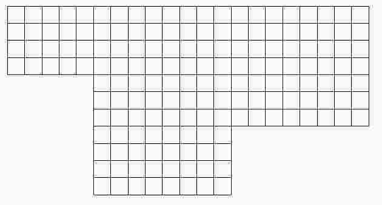

# Operaciones 1

## Completá estas tablas

<table border="2" cellspacing="0" cellpadding="6" rules="groups" frame="hsides">

<colgroup>
<col  class="left" />

<col  class="right" />

<col  class="right" />

<col  class="right" />

<col  class="right" />

<col  class="right" />

<col  class="right" />

<col  class="right" />

<col  class="right" />

<col  class="right" />
</colgroup>
<tbody>
<tr>
<td class="left">Cajas iguales de barritas</td>
<td class="right">2</td>
<td class="right">5</td>
<td class="right">7</td>
<td class="right">10</td>
<td class="right">20</td>
<td class="right">25</td>
<td class="right">30</td>
<td class="right">33</td>
<td class="right">200</td>
</tr>

<tr>
<td class="left">Cantidad de barritas</td>
<td class="right">&#xa0;</td>
<td class="right">120</td>
<td class="right">&#xa0;</td>
<td class="right">&#xa0;</td>
<td class="right">&#xa0;</td>
<td class="right">&#xa0;</td>
<td class="right">&#xa0;</td>
<td class="right">&#xa0;</td>
<td class="right">&#xa0;</td>
</tr>
</tbody>
</table>

&#x2014;

<table border="2" cellspacing="0" cellpadding="6" rules="groups" frame="hsides">

<colgroup>
<col  class="left" />

<col  class="right" />

<col  class="right" />

<col  class="right" />

<col  class="right" />

<col  class="right" />

<col  class="right" />

<col  class="right" />

<col  class="right" />
</colgroup>
<tbody>
<tr>
<td class="left">Paquetes de CD</td>
<td class="right">2</td>
<td class="right">3</td>
<td class="right">&#xa0;</td>
<td class="right">6</td>
<td class="right">10</td>
<td class="right">&#xa0;</td>
<td class="right">30</td>
<td class="right">39</td>
</tr>

<tr>
<td class="left">Cantidad de tuercas</td>
<td class="right">&#xa0;</td>
<td class="right">432</td>
<td class="right">576</td>
<td class="right">&#xa0;</td>
<td class="right">&#xa0;</td>
<td class="right">2.880</td>
<td class="right">&#xa0;</td>
<td class="right">&#xa0;</td>
</tr>
</tbody>
</table>

## Matías y Lorena calcularon de maneras diferentes cuántos cuadraditos hay en esta figura

Matías: 13x4 + 8x7 + 8x7 
&#xa0;&#xa0;&#xa0;&#xa0;&#xa0;&#xa0;&#xa0;&#xa0;&#xa0;52  + 56 +  56 = 164 
Lorena: 4x21 + 3x16 + 4x8 
&#xa0;&#xa0;&#xa0;&#xa0;&#xa0;&#xa0;&#xa0;&#xa0;&#xa0;84  + 48  +  32 = 164 
 

-   Escribí otros cálculos que permitan averiguar la cantidad de cuadraditos

## En una pared se colocaron 18 filas de 24 cerámicas cada una.

1.  ¿Es cierto que si se duplica la cantidad de filas, la cantidad total de cerámicas es el doble?
2.  Si se duplican la cantidad de filas y de cerámicas por fila, ¿Cuántas cerámicas se necesitan?
3.  Si la cantidad de filas y cerámicas por fila se reduce a la mitad ¿Es cierto que la cantidad total de cerámicas se reduce a la cuarta parte?

# Bibliografía - Sitiografía:

-   Diseño Curricular de la Ciudad de Buenos Aires
-   Matemática en sexto. Santillana
-   [Khan Academy](http://es.khanacademy.org)

<h2 class="footnotes">Nota al pie de p&aacute;gina: </h2>

<a id="fn.1" class="footnum" href="#fnr.1">1</a> La idea de este ejercicio es que los estudiantes utilicen el compás con múltiples propósitos (medir y trazar) y relacionen el radio de la circunferencia para el trazado con el diámetro final de las figuras.

<a id="fn.2" class="footnum" href="#fnr.2">2</a> Esta actividad es para comenzar a reflexionar sobre la necesidad de contar con un lenguaje común que abstraiga las propiedades de las figuras para poder reflexionar sobre eso.

<a id="fn.3" class="footnum" href="#fnr.3">3</a> Feriados Día de la memoria por la verdad y la justicia

<a id="fn.4" class="footnum" href="#fnr.4">4</a> Feriados Semana Santa

